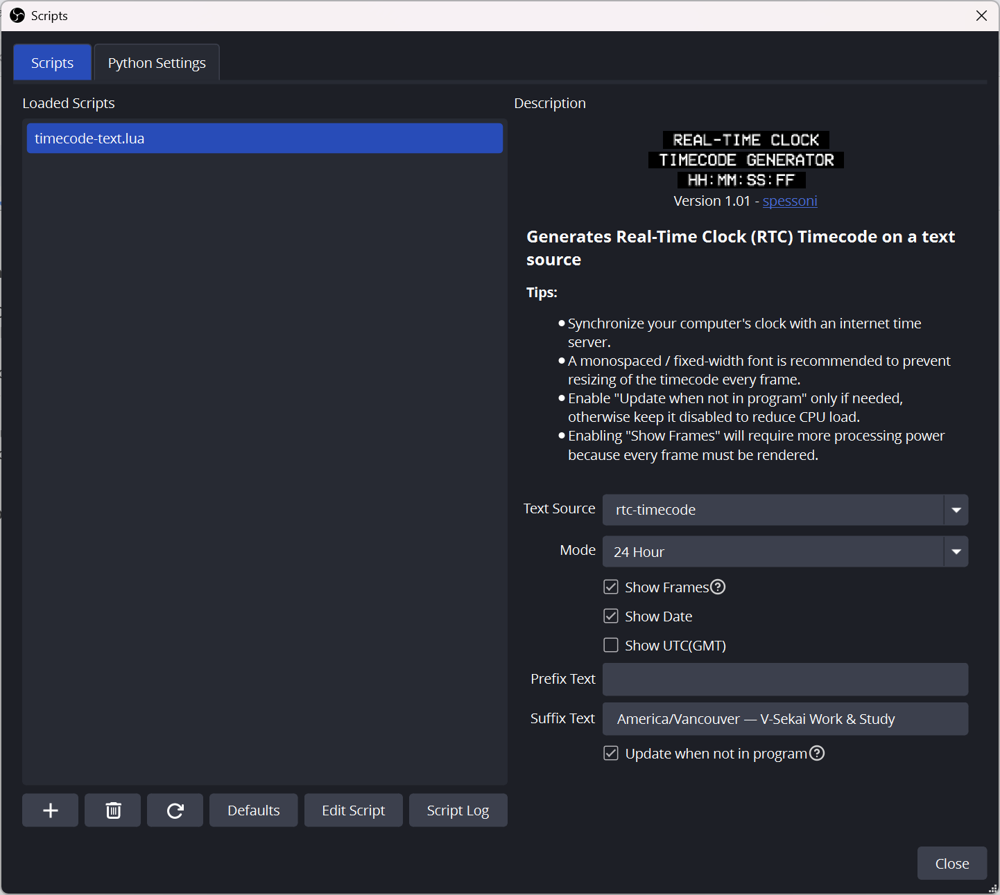

# Core_Streaming_Steam_Deck

OBS Streaming Work/Study

- HDMI Dongle
  - EVanlak HDMI Dummy Plug Headless Ghost Premium Aluminum Display Emulator Light Revelation 4k Dummy Plug HDMI Plugs Headless Machines Fit Anyone with a Headless GUI Server 3rd 3840x2160@60H
- Elgato H60 X capture card
- Steam deck OLED
- USB-c cable (usb4)
- HDMI cable
- Steam dock with HDMI output
- Obs-studio on Windows 11
- Discord
  - Share capture device
  - Audio device must be set to Elgato audio
- OBS Overlay
  - Timecode
    - Use https://windows-time-synchronizer.en.softonic.com/
  - FPS counter from steamdeck
  - Make background 50% opactiy
  - Don’t overlap FPS counter with the timecode
  - ![][image1]

```
git clone https://github.com/V-Sekai/v-sekai-game.git
git clone https://github.com/V-Sekai/world-godot
install steamdevkit client
setup connection
```


